# Administrator manual to jenkins-ci service

## Prepared dependencies
1. java jdk-8 and up
1. git-cli
1. python 3.6 and up
1. homebrew
1. xcode
1. xcode-cli
1. android studio

## Python library
all in latest version.  
1. requests
1. urllib
1. virtualenvwrapper
1. robotframework
1. robotframework-selenium2library
1. robotframework-appiumlibrary
1. robotframwork-pythonlibcore
1. pyOpenSSL

## How to start web service
- Open lauchpad > BrewServiceManubar  
    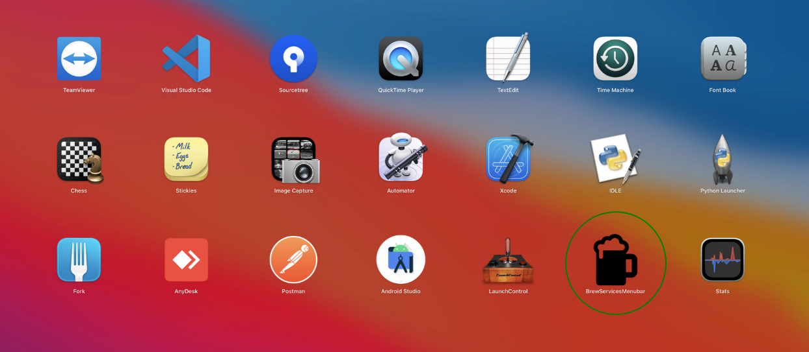  
- In menubar > check `jenkins-lts`  and you can manage all service:
    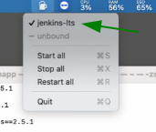
    - Start all  
    - Stop all  
    - Restart all  
- In terminal you can start ngrok services in backgroud process.
    - To start ngrok  
        ```bash
        # Start process in launchd
        $ launchctl load -w ~/Library/LaunchAgents/io.dtac.ngrok.plist
        ```
    - To stop ngrok  
        ```bash
        # Stop ngrok and unload from launchd
        $ launchctl unload -w ~/Library/LaunchAgents/io.dtac.ngrok.plist
        ```
- Open any browser and go to `https://dtac.ap.ngrok.io`, then it should redirect to github oauth api.  
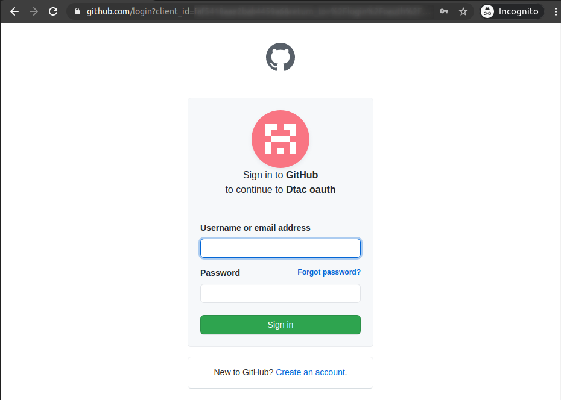
- login with your account, so your browser callback to jenkins web-service

## Jenkins dashboard

### Robotframework test with iOS application
- Open job's folder `Robot-iOS`.
- See multi-branch builder in `Auto Build and Test with multiple branch`  
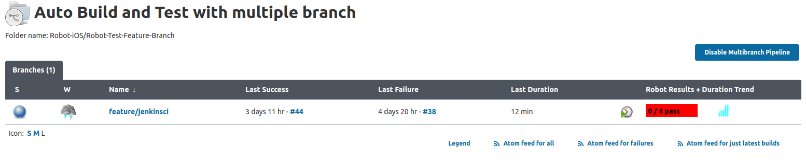
    - In each branch pipeline test with latest iOS version(14.3)  
    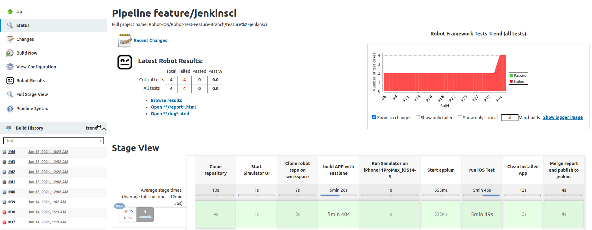
    - If you re-build in branch, in left menu select `build now` 
    
    - After pipeline success you can see summary report and relative with previous build in top page.  
    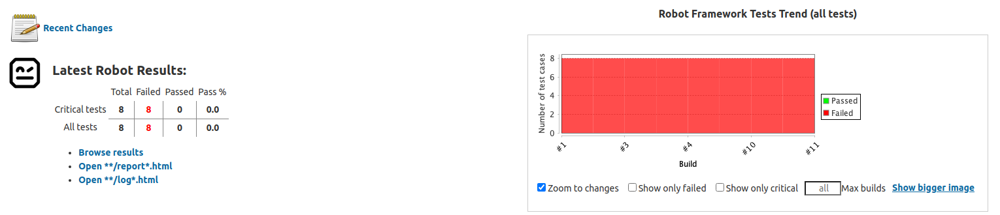
    - Or see more detail for `robot results` with original report in left menu 
    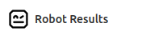  
    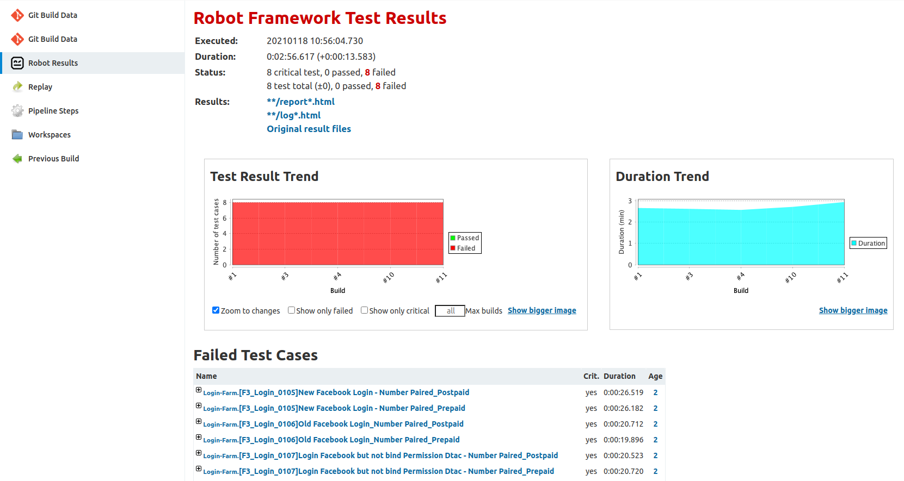  
- Or run CI with manaul selecte branch in `Pipeline Selected branch for manual Robot test`  
    - Click `Build with Parameters` to start full robot test.
    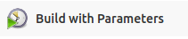
    - Select list of git branchs in **SELECTED_BRANCH** box and `build`.  
    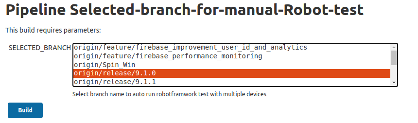
    - See `robot results` with original report like above job.
  
    
### Robotframework test with Android application
- Open job's folder `Robot-iOS`.
- See multi-branch builder in `Auto Build and Test with multiple branch`  
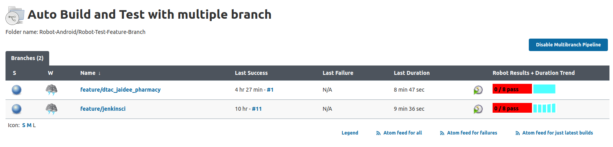
    - In each branch pipeline test with latest android OS version(11)  
    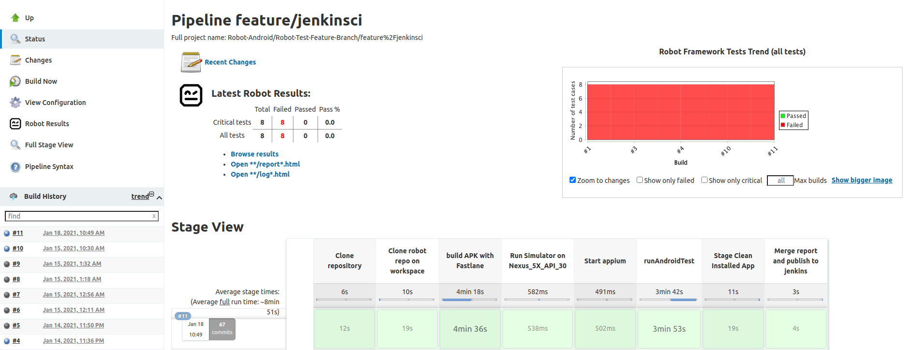
    - If you re-build in branch, in left menu select `build now` 
    
    - After pipeline success you can see summary report and relative with previous build in top page.  
    
    - Or see more detail for `robot results` with original report in left menu 
      
      
- Or run CI with manaul selecte branch in `Pipeline Selected branch for manual Robot test`
    - Click `Build with Parameters` to start full robot test.
    
    - Select list of git branchs in **SELECTED_BRANCH** box and `build`.  
    
    - See `robot results` with original report like above job.

## Support contact
Any problem in usage **jenkins**, you should contact Support Engineer in *line*.